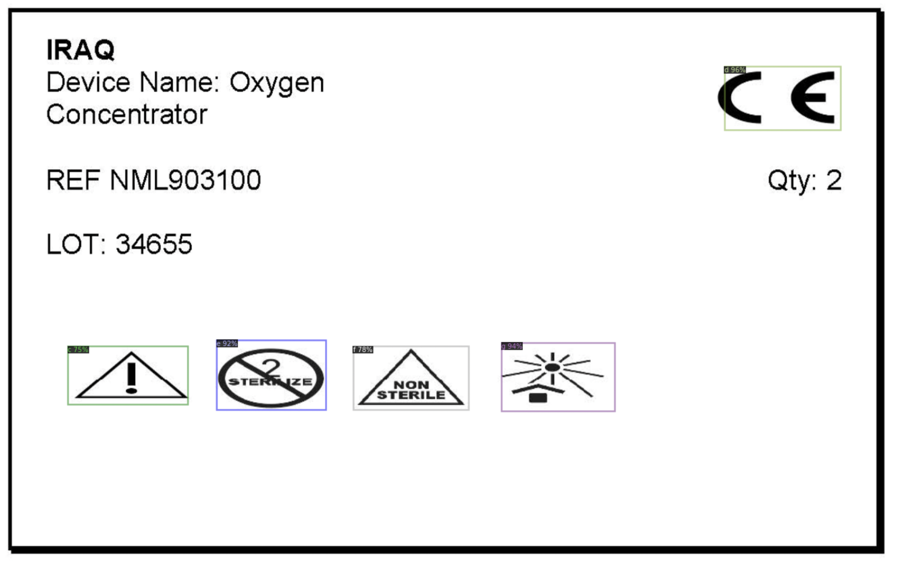

# Parleg Beta | OCR and Logo Detection & Recognition


[Collab Link](https://colab.research.google.com/drive/1W3C6nRJUkuT_Tdpd6Z73yAOzLvzLcRZJ?usp=sharing)

As we have done in the [Parleg-Alpha](https://github.com/gamingflexer/parleg-alpha) project, We have successfully implemented the croping of the required part of the image.
The project is divided into two parts because we get video footage of the boxes moving on a conveyor belt. In this project, we have implemented the OCR and Logo Detection & Recognition in a particular order. 

## Problems to solve 

- OCR of the image
- Find and match appropriate matches for REF, LOT, Qty & Device Name.
- Detection of “Symbols” in the images
- Recognition of “Symbols” in the images
- Saving the data in a CSV file in a particular order.

## Solution

- Use easy ocr to extract text from the images and using regular expressions to match the other field required which were REF, LOT, Qty & Device Name
- Annotated images in COCO format
- Augmented dataset as the images were only 8 and very unbalanced. (for ex - number 3 symbols images are very low)
- Trained Faster RCNN Detectron 2 model for detection & recognition of the symbols with custom augmentation classes to do in-training augmentation of images.
- Used the bounding box & simple image processing to find the position of the symbols and add them to excel using pandas dataframe.

One could go by finding contours and making bounding boxes but they generally work good only for text rather than complex objects, instead they can be used as labeling functions.

# Installation

Clone the repository and then install detectron2 using the following command

```
python -m pip install pyyaml==5.1 -q

git clone 'https://github.com/facebookresearch/detectron2'
cd detectron2
pip install -e detectron2
```

For linux users, also run the following command

`apt-get install poppler-utils`

# Train the model

In the src folder there is `train.py` read the comments in it and change the paths accordingly and then run the file.
For more information on how to train the model, refer here :

This also contains scripts for dataset conversions and common issues faced while training the model.

- [Easy to Train Detectron2](https://github.com/gamingflexer/object-detection-custom-models-scripts)

- [Detectron2 Documentation](https://detectron2.readthedocs.io/en/latest/tutorials/datasets.html)

# Test the model

Run `main.py` in the src folder and change the paths accordingly for the folder to be tested.

# Results
Csv file generated after running the model on the test images with segregated results for each image.

```
|    | Device Name   | REF       | LOT   | Qty | Symbols |
|----|---------------|-----------|-------|-----|---------|
| 0  | Oxygen        | NML903100 | 34655 | 3   | 43567   |
| 1  | Pulse         | NML903055 | 34683 | 1   | 2369    |
| 2  | HFNC Machine  | NML903095 | 34648 | 1   | 1289    |
| 3  | Bi-Pap        | NML90311O | 34669 | 3   | 3578    |
| 4  | ECG Machine   | NML903060 | 34690 | 1   | 2578    |
| 5  | NIBP          | NML903050 | 34676 | 3   | 4127    |
| 6  | C-Pap         | NML903105 | 34662 | 3   | 19578   |
| 7  | Infusion Pump | NML903065 | 34697 | 1   | 2589    |
| 8  | Blood Warmer  | NML903090 | 34641 | 1   | 1       |
```

